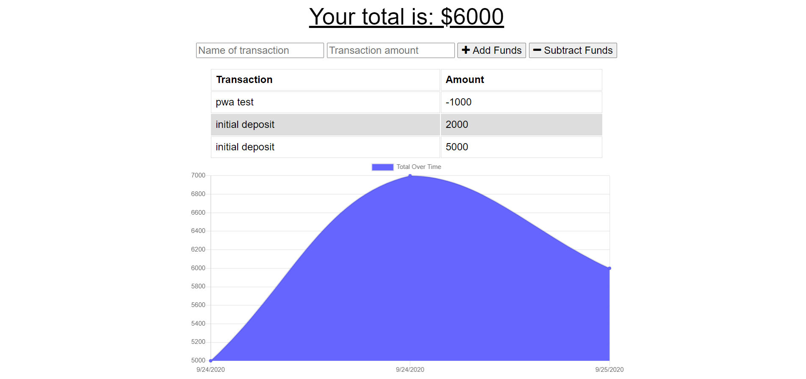

# Budget Tracker

[Visit site](https://stormy-cove-01459.herokuapp.com/)

## Description

An installable Progressive Web Application for tracking bank deposits and expenditures.  Project is built using Express.js, Service Workers and the IndexDB API

## Table of Contents
  * [Installation](#installation)
  * [Usage](#usage)
  * [License](#license)
  * [Contributing](#contributing)
  * [Testing](#testing)
  * [Questions](#questions)
  
## Installation
Clone project to a directory on your local machine and cd into the budget-tracker directory.  Run <$ npm install> to install dependencies.

## Usage
Run <$ npm start> to launch a local development server on port 3001.  Or visit the deployed site [here](https://stormy-cove-01459.herokuapp.com/).  Add a transaction name and amount, then click the appropriate button to add or subtract funds.  A running total of your balance will be displayed along with a line graph displaying the macro trends of your activity.  Because of it's Progressive features, the application will remain usable and data will be up to date,  even when internet connectivity is weak or non-existent.  The application can also be installed on your home page by pressing the + icon in the  URL bar of desktop browsers, or by selecting the 'Add to Home screen' option in the options provided by your smart phone browser.

## License 
This project is covered under the MIT license 

## Contributing
To see the guidelines adopted for contributing to this project, please view the [Contributor Covenant](https://www.contributor-covenant.org/version/2/0/code_of_conduct/code_of_conduct.txt)

## Testing
Tests coming soon

## Questions
Visit me at GitHub  
[christopherConcannon](https://github.com/christopherConcannon)
  
If you have any questions or would like to contact me, please email me at  
[cmcon@yahoo.com](mailto:cmcon@yahoo.com)
